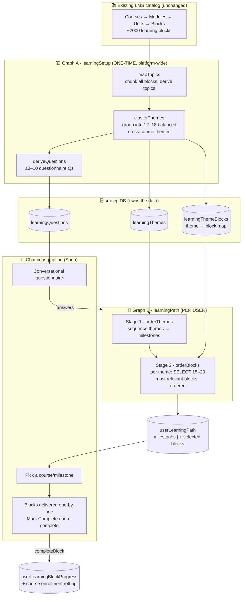
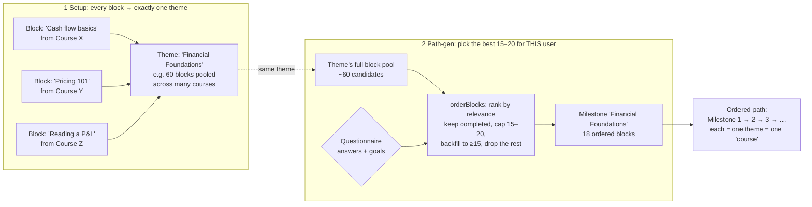
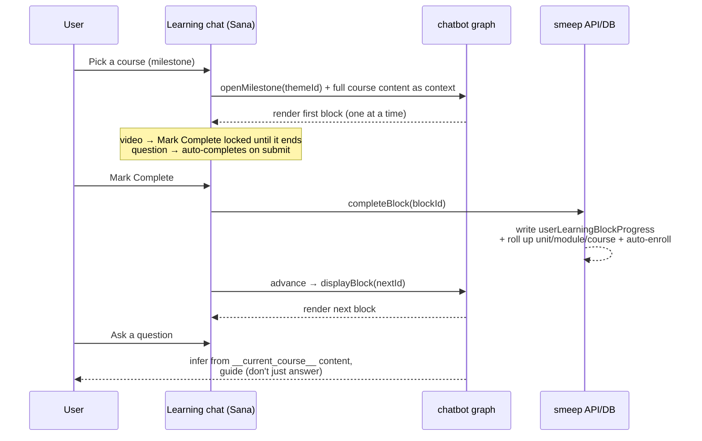

# AI Personalized Learning Path — Architecture

How the personalized learning path is built and consumed. It's built on **two
stateless AI graphs** (on the potential-Ai service) plus the smeep DB/UI that
owns all data and the chat.

## The big picture

- **Existing courses are untouched.** A course is `Course → Module → Unit → Block`
  (a *block* = one piece of content: text, video, image, or question).
- **Graph A (`learningSetup`)** runs **once for the platform**: reads *every* block
  across all published courses and reorganizes them into **cross-course themes** +
  a short **questionnaire**.
- **Graph B (`learningPath`)** runs **per user**: takes their questionnaire answers
  and turns the themes into an ordered **path of milestones**, picking the
  **15–20 most relevant blocks per theme**.
- The **chat** (Sana) walks the user through it one block at a time; completing a
  block writes the same `userLearningBlockProgress` the normal course pages use
  (dual-sync) and auto-enrolls them in the parent course.

## How blocks get allocated to a path

Blocks flow **catalog → theme → per-user milestone**:

**Key rules in the allocation:**

| Stage | What happens | Guardrails |
|---|---|---|
| **Setup → theme** | `clusterThemes` assigns each block to one cross-course theme; consolidated to **12–18 balanced** themes | Final block IDs intersected against real `learning_blocks` (drops AI hallucinations) |
| **Theme → milestone order** | `orderThemes` sequences themes using the questionnaire (one cheap call) | Every theme appears exactly once; missing ones appended |
| **Block selection (per theme)** | `orderBlocks` picks the **15–20 most relevant** blocks to the theme/user and orders them | Hard cap 20; backfill to `min(15, available)`; **completed blocks always kept**; hallucinated IDs filtered |

So a theme might pool ~60 blocks from several courses, but a given learner's
milestone only carries the **15–20 most accurate** for them — that's the
"we don't use all the blocks" behavior.

## At runtime in the chat

Two things worth highlighting:

- **Dual-sync:** completing a block in chat writes the exact same progress table as
  the normal course pages, so progress is consistent both ways and the parent
  course auto-enrolls.
- **Grounded guidance:** when a course is opened, its full block content is fed to
  the AI (`__current_course__`), so course-related questions are answered *from the
  real material* and used to guide the learner rather than hand over answers.

## Where things live

| Concern | Location |
|---|---|
| Graph A (`learningSetup`) | `potential-Ai/src/graphs/learningSetup/graph.ts` |
| Graph B (`learningPath`) | `potential-Ai/src/graphs/learningPath/graph.ts` |
| AI client + JWT + endpoints | `potential-smeep/server/services/learning/aiClient.ts`, `learning.service.ts` |
| DB schema (themes/questions/path) | `potential-smeep/server/db/schema/learning.ts` |
| Routes/controllers | `potential-smeep/server/routes/lms.ts`, `server/controllers/learning/learning.controller.ts` |
| Questionnaire UI | `potential-smeep/client/components/dashboard/ConversationalQuestionnaire.tsx` |
| Chat consumption UI | `potential-smeep/client/components/dashboard/EmbeddedLearningAssistant.tsx` |
| Learning page | `potential-smeep/client/app/(dashboard)/dashboard/learning/page.tsx` |
